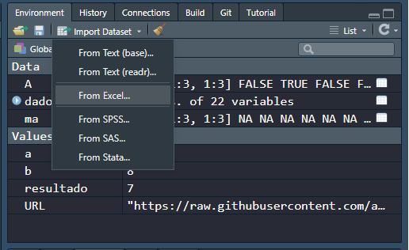
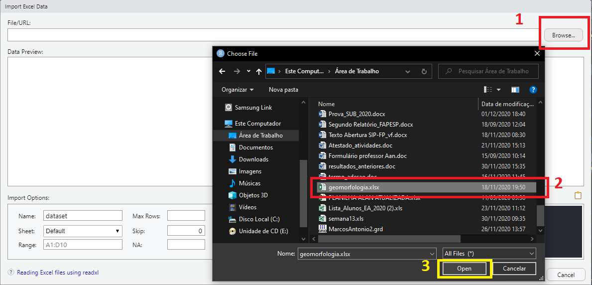
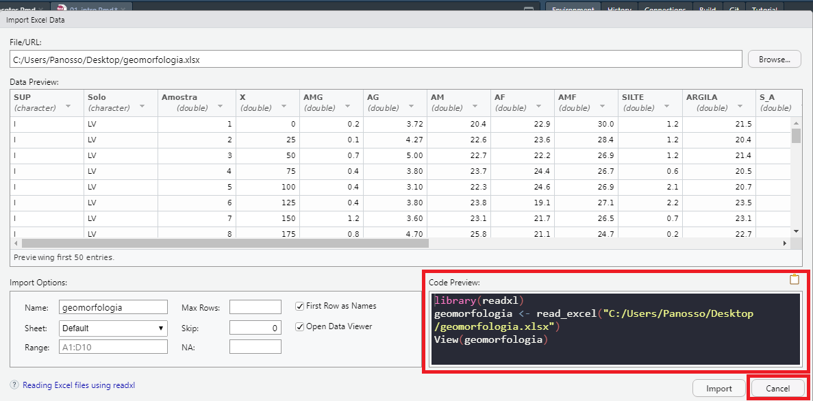
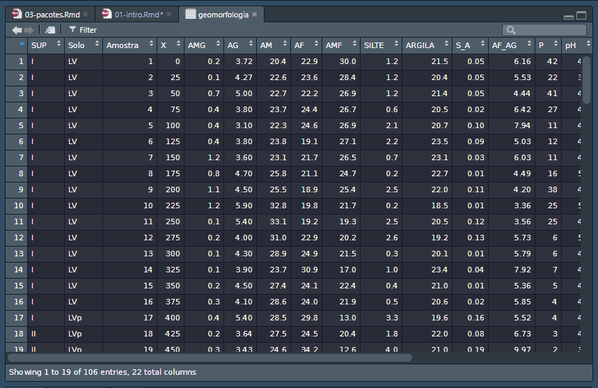
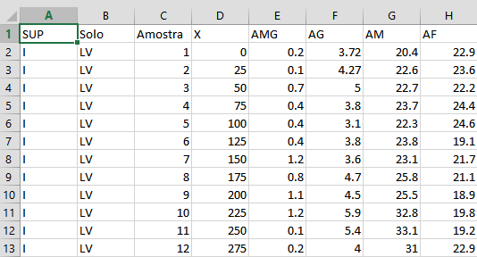
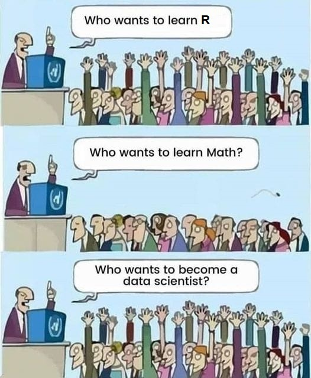
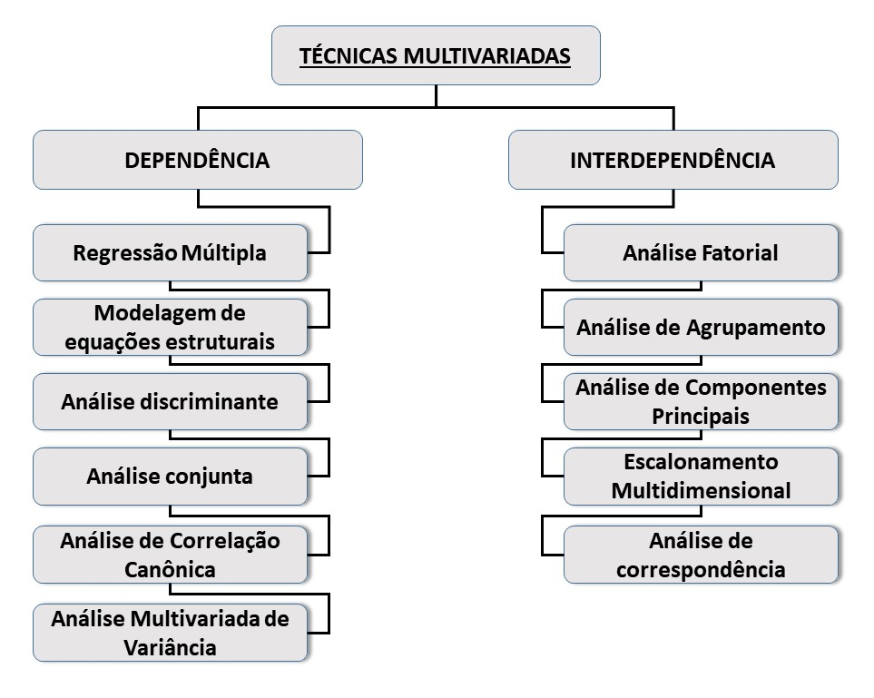
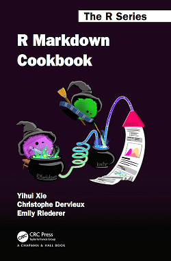

# Introdução à Ciência dos Dados

A Ciência dos Dados, ou *Data Science*, é uma área interdisciplinar voltada para o estudo e a análise de dados, estruturados e não-estruturados, que visa a extração de conhecimento, detecção de padrões e/ou obtenção de variáveis para possíveis tomadas de decisão. 

O modelo base das ferramentas necessárias em um projeto típico de ciência dos dados é parecido com isso:

```{r echo=FALSE, fig.cap="Modelo base de um projeto de Ciência dos Dados.", fig.align='center', out.width = "500px"}
knitr::include_graphics("img/data-science.png")
```

## Importação

Primeiro devemos *importar* os dados no R. Ou seja, pegar os dados armazenados em um arquivo, base de dados ou na Web e carregá-los em uma estrutuda de dados no R. 

Sem eles no R, não conseguiremos fazer Data Science.

Para essa prática, vamos utilizar um banco de dados oriundo de um estudo geomorfológico.

**Importação via web**   

Acesse o banco de dados na web: Clique no link para o arquivo  [geomorfologia.txt](https://raw.githubusercontent.com/arpanosso/r_data_science_fcav/master/dados/geomorfologia.txt).

```{r}
# definir o caminho
URL <- "https://raw.githubusercontent.com/arpanosso/r_data_science_fcav/master/dados/geomorfologia.txt"
  
# Importação
dados<-read.table(URL,
                  header = TRUE) # Argumento para cabeçalho na primeira linha

# Inspeção do banco de dados
head(dados) # mostra o 6 primeiros registros
```

**Importação via Excel**   

Acesse o banco de dados para essa prática, denominado [geomorfologia.xlsx](https://github.com/arpanosso/r_data_science_fcav/raw/master/dados/geomorfologia.xlsx), salve o arquivo em uma pasta de seu computador.


```{r echo=FALSE, fig.cap="Na aba **Environment** selecione a opção **Import Dataser** e escolha **From Excel...**", fig.align='center', out.width = "500px"}

```

```{r echo=FALSE, fig.cap="1) Clique em **Browse...**, acesse a pasta na qual você salvou o arquivo; 2) selecione o arquivo **geomorfologia.xlsx**; 3) clique em **Open.**", fig.align='center', out.width = "900px"}

```

```{r echo=FALSE, fig.cap="Pré-visualização dos dados, observe que o código de importação é apresentado abaixo dessa janela. Copie esse código, e clique em **CANCEL**.", fig.align='center', out.width = "800px"}

```

Cole as linhas de código no script do R e as execute, para ter a importação dos dados.

```{r}
library(readxl)
geomorfologia <- read_excel("C:/GitHub/r_data_science_fcav/dados/geomorfologia.xlsx")
```

```{r echo=FALSE, fig.cap="Após executar o código, os dados devem ser apresentados dessa forma.", fig.align='center', out.width = "500px"}

```

## Organização

Uma vez que os dados estão no R, a próxima etapa é organizá-los, ou seja, armazená-los de uma forma consistente que combine a semântica da base de dados com a maneira com a qual eles são armazenados. 

Cada coluna é uma variável e cada linha é uma observação.

```{r echo=FALSE, fig.cap="Exemplo de dados organizados em planilha eletrônica, onde cada coluna é uma variável e cada linha é uma observação, ou registro.", fig.align='center', out.width = "500px"}

```

 > Observação: O R, como a maioria dos softwares estatísticos, utiliza o **ponto** como **separador decimal**, ou seja, como o símbolo usado para separar a parte inteira da parte complementar não inteira da representação decimal do numeral de um real (ponto flutuante).
 
 > Portanto, aconselhamos você a padronizar o separador decimal do seu computador. Para isso sigua os passos abaixo:


```{r echo=FALSE, fig.cap="Acesse o PAINEL DE CONTROLE, na opção REGIÃO clique em  CONFIGURAÇÕES ADICIONAIS... e modifique o SÍBOLO DECIMAL para PONTO e o SÍMBOLO DE AGRUPAMENTO DE DÍGITO para VÍRGULA.",fig.align='center',out.width = "600px"}
knitr::include_graphics("img/meuGif_2.gif")
```

Vamos conhecer a estrutura do nosso banco de dados, a partir da função `str`. 
```{r}
str(dados)
```

Podemos identificar que os dados são compostos por 106 linhas e 22 colunas. As duas primeiras colunas são do tipo texto (**chr** - *character*) e as demais colunas são numéricas (**num** - *numeric*).

## Transformação dos dados

O termo transformação significa literalmente recortar o banco de dados, assim podemos focar nas observações de interesse. Criar novas variáveis em função das existentes e calcular, por exemplo, um resumo estatístico desse conjunto de interesse. 

Por exemplo, vamos selecionar somente os solos do tipo **LV**.

```{r}
# Criar um filtro 
f <- dados$Solo == "LV"

# Criar um banco de dados auxiliar da
da <- dados[f,]

# Vamos ver a estrutura desse banco auxiliar
str(da)
```

Vamos continuar o processo de filtragem e selecionar somente as colunas **SUP**, **ARGILA**, **SILTE** e **T**.

```{r}
da<-da[,c(1,11,10,21)]
str(da)
```

Vamos criar uma nova variável, **ARG_SILT** a partir da soma dos valores de **ARGILA** + **SILTE**, para isso vamos utilizar o símbolo de acesso de colunas, o cifrão (**$**). Em seguida, aplicaremos a transformação logarítmica aos dados de **T**.   

```{r}
da$ARG_SILT <- da$ARGILA + da$SILTE
da$Log_T <- log10(da$T)
str(da)
```

Agora vamos gerar um resumo estatístico para esses dados. A primeira coluna é do tipo texto, então, deve ser retirada do banco de dados auxiliar `da` antes de realizarmos os cálculos. Para isso, utilizamos o índice $-1$ na dimensão das colunas do objeto `da`, ou seja, estamos retirando a coluna 1 **SUP** de `da`.

```{r}
# Número de observações
apply(da[,-1],2,length)

# Média
apply(da[,-1],2,mean)

# Mediana
apply(da[,-1],2,median)

# Variância
apply(da[,-1],2,var)

# Desvio Padrão
apply(da[,-1],2,sd)

# Podemos utilizar a função summary.
summary(da[,-1])
```

Agora podemos gerar o conhecimento, por meio da **Visualização** e **Modelagem**.

Essas tem suas vantegens e desvantagens as quais são complementares, portanto, quaisquer análises reais farão muitas vezes iteraçoes entre elas.

```{r echo=FALSE, fig.cap="Visualização e modelagem são dois processos iterativos, onde a matemática é uma ferramenta essencial para a extração de padrões, declaração e testes de hipóteses.", fig.align='center', out.width = "400px"}

```

## Visualização

Atividade fundamentalmente humana, uma boa visualização lhe mostrará coisas que não esperava, ou levantará novas questões sobre os dados. Além disso, pode mostrar também que você esta fazendo a pergunta errada, ou que precisa coletar dados diferentes. Visualizações podem surpreender o analista de dados, mas não escalam particularmente bem, por que requerem um humano para interpretá-las.


```{r}
plot(da$ARGILA,da$T)
```

## Modelação

*Modelo* são ferramentas complementares da visualização. Uma vez que você tenha feito perguntas suficientemente precisas, poderá usar um modelo para respondê-las. Modelos são fundamentalmente matemáticos ou computacionais, então, geralmente escalam muito bem. Porém, cada modelo faz suposições e, por sua própria natureza, não podem questionar suas própria hipóteses, ou seja, um modelo não pode nos surpreender.

```{r}
plot(da$ARGILA,da$T)
mod<-lm(da$T~da$ARGILA)
summary.lm(mod)
abline(mod)
```


### Exemplo de Análise multivariada (PCA)

```{r echo=FALSE, fig.cap="Classificação das técnicas multivariadas (Dependências e Interdependência).", fig.align='center', out.width = "400px"}

```
Carregando alguns pacotes

```{r}
library(vegan)
library(corrplot)
```

Matriz de Correlação

```{r}
geomorfo_num <- geomorfologia[-(1:5)]
matriz_correlacao <- cor(geomorfo_num)
corrplot(matriz_correlacao)
```

```{r}
corrplot(matriz_correlacao, method = "ellipse")
```

```{r}
corrplot.mixed(matriz_correlacao, lower.col = "black", upper = "ellipse")
```

Notoriamente existem muitas variáveis, vamos filtar e transformas

```{r}
str(geomorfo_num)
geomorfo_num$AREIA <- geomorfo_num$AG + geomorfo_num$AM + geomorfo_num$AF + geomorfo_num$AMF
```
Vamos selecionar alguams variáveis

```{r}
geomorfo_nun_selecionada <- geomorfo_num[c("AREIA","SILTE","ARGILA", "P", "pH", "K","Ca","Mg","H_Al")]
matriz_correlacao_selecionada <- cor(geomorfo_nun_selecionada)
corrplot.mixed(matriz_correlacao_selecionada,lower.col = "black", upper = "ellipse")
```

Para a análise de componente principais, primeiramente devemos padronizar o banco de dados, assim utilizamos o argumento `scale = TRUE` da funçaõ `prcompr`.

```{r}
da <- decostand(geomorfo_nun_selecionada,method = "standardize",na.rm = TRUE)
pca <- prcomp(geomorfo_nun_selecionada,scale. = TRUE)
summary(pca)
```

Extraindo os autovalores

```{r}
eig <- pca$sdev^2
eig
```

Porcentagem da variância explicada por cada componente

```{r}
ve<-eig/sum(eig)
ve
```

Porcentagem acumulada
```{r}
cumsum(ve)
```


```{r}
# pca # Autovalores das variáveis
# pca$x # coordenadas dos acessos
```


Correlações entre cada variável - poder discriminante
```{r}
mcor<-cor(da, pca$x) 
corrplot(mcor)
```

Screeplot, para verificar os PC maiores que a Unidade, de acordo com Kaiser, valores maiores que 1

```{r}
screeplot(pca)
barplot(eig,
        names.arg=colnames(pca$rotation),
        ylim=c(0,(pca$sdev^2)[1]*1.1),
    ylab="Inertia",xlab="Principal Component",cex.lab=1.2
    ,main="Sreeplot")
abline(h=1,lty=2)
```

Construção do Biplot e sua tabela
```{r}
grupos <- geomorfologia$SUP
biplot(rda(da),pch=2)
ordihull(rda(da),
         group = grupos,
         col=1:nlevels(as.factor(grupos)))

```

Construção do biplot usando as funções básicas
```{r}
pc1V<-cor(da,pca$x)[,1]/sd(cor(da,pca$x)[,1])
pc2V<-cor(da,pca$x)[,2]/sd(cor(da,pca$x)[,2])
pc1c<-pca$x[,1]/sd(pca$x[,1])
pc2c<-pca$x[,2]/sd(pca$x[,2])
nv<-ncol(da) # número de variáveis utilizadas na análise
plot(pc1V,pc2V,
     xlim=c(min(-3,pc1V,pc1c),
            max(pc1V,pc1c,5)),
     ylim=c(min(pc2V,pc2c),
            max(pc2V,pc2c)),pch="",las=1,
     xlab=paste("PC1 (",round(100*ve[1],2),"%)",sep=""),
     ylab=paste("PC2 (",round(100*ve[2],2),"%)",sep=""),
     font.lab=2)
abline(v=0,h=0)
arrows(rep(0,nv),rep(0,nv),pc1V*.90,pc2V*.90,lwd=1.5,length=.1)
text(pc1V,pc2V,names(pc1V),font=4)
lv<-as.factor(grupos);nlv<-levels(lv)

# Adicionando os identificadores dos acesso partir de uma variável categórica
for(i in 1:length(nlv)){
  ff<-lv==nlv[i]  
  # points(pc1c[ff],pc2c[ff],cex=1.3,col=i,pch=i+15) 
  # df$Municípios[ff]
   text(pc1c[ff],pc2c[ff],grupos[ff],cex=.8,col=i)}
```

Tabela do Biplot com as correlações com as PCs e seus respectivos autovetores
```{r}
ck<-sum(pca$sdev^2>=1)
tabelapca<-vector()
for( l in 1:ck) tabelapca<-cbind(tabelapca,mcor[,l])#,pca$rotation[,l])
colnames(tabelapca)<-paste(rep(c("PC"),ck),1:ck,sep="")
pcat<-round(tabelapca,3)
summary(pcat)
tabelapca<-tabelapca[order(abs(tabelapca[,1])),]
tabelapca
```

Uma opção à tabela resumo

```{r}
library(plotrix)
pyramid.plot(abs(tabelapca[,1]),abs(tabelapca[,2]),
             labels = names(tabelapca[,1]),
             unit="Correlation",gap=.1,raxlab=c(0,0.25,.5,.75,1),
             top.labels = c("PC1 (33.85%)", "Variable", "PC2 (25.16%)"),
laxlab=c(0,0.25,.5,.75,1),
             lxcol=c("darkgray","white","darkgray","darkgray","darkgray",
             "darkgray"),rxcol=c("white","white","darkgray","darkgray",
             "white","white"))
text(-1*abs(tabelapca[,1]),1:6,round(tabelapca[,1],2))
text(abs(tabelapca[,2]+c(0,0,0,0,-.04,0)),1:6,round(tabelapca[,2],2))
box()
```

## Comunicação

É a última etapa do Data Science, a mais importante. Não importa quão bem seus modelos e visualizações o levaram a entender os dados, a menos que você também consiga comunicar seus resultados para outras pessoas.

Uma dica importante, é estudar **RMarkdown**! Ótima linguagem de marcação de texto, utilizada para gerar relatórios em HTML, .doc e pdf. Inclusive, esse material que estamos utilizando no curso.

```{r echo=FALSE, fig.cap="https://bookdown.org/yihui/rmarkdown-cookbook/",fig.align='center',out.width = "200px"}

```

## Programação

Permeia todas as etapas da Ciência dos Dados.

Ao nosso ver é uma questão recursiva...

O computador é a ferramenta do cientista de dados.

R é um ambiente e linguagem de programação de código aberto para computação estatística, bioinformática e gráficos.

  * Como linguagem de programação, garante a reprodutibilidade das análises.
  
    + Estudantes podem usar as mesmas ferramentas que os profissionais.

    + Todos podem usar as melhores ferramentas independente do poder financeiro.

    + Qualquer um pode reproduzir as suas análises.

    + Você pode corrigir problemas.

    + Você pode desenvolver suas próprias ferramentas.

  * Linguagem orientada a objetos R  (Ross Ihaka e Robert Gentleman).

  * R é uma poderosa linguagem, flexível e possui excelentes facilidades gráficas.

  * R é um projeto **open-source** e está disponível na internet sobre a General Public License (<www.gnu.org/copyleft/gpl.html> e <www.fsf.org>).

