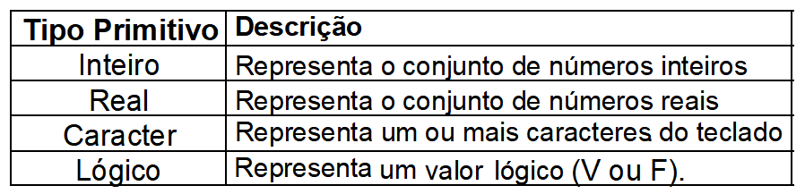

# Tópicos iniciais  

## Identificadores

São nomes únicos definidos pelos programadores para identificar/distinguir os elementos de um programa.

## Palavras Reservadas

São instruções primitivas que têm significados pré-determinados e fazem parte da estrutura de qualquer linguagem de programação.

## Regras para os nomes de Identificadores  
  *1) Devem começar por um caractere alfabético;   
  *2) Podem ser seguidos por mais caracteres alfabéticos e/ou numéricos;   
  *3) Não é permitido o uso de espaço em branco ou de caracteres especiais, como: @, #, &, ?, $ (exceto o _ e o .);  
  *4) Não poderá ser uma palavra reservada a uma instrução do algoritmo (if, else, for, while, entre outras);  
  *5) Devem ser significativos.

Geralmente, desejamos que os nomes dos objetos sejam descritivos, então precisaremos de uma convenção para várias palavras. 

Recomendamos *snake_case*, onde você separa palavras minúsculas com _ .


```{r,eval=FALSE}
eu_uso_snake_case
outrasPessoasUsamCamelCase
algumas.pessoas.usam.pontos
E_algumasPoucas.Pessoas_RENUNCIAMconvenções
```

## Tipos de dados

As fases de Entrada, Processamento e Saída podem manipular vários tipos primitivos de dados, a saber: 

```{r echo=FALSE, fig.cap="Tipos primitivos de dados",fig.align='center',out.width = "600px"}

```

Um Caractere **SEMPRE** deve estar entre aspas duplas **\"   \"** ou simples **'    '**. Por exemplo: `"A"`, `"Fone 3333-33333"`, `"1"`, `'3.1415'`, `'a mais bonita'`,etc. 

```{r}
" Olá, eu sou um texto."
'1' # não pode ser feito cálculos
3.14 # DOUBLE: valor real, de ponto flutuante.
1  # valor numérico inteiro, 
4L #sufixo L temos números inteiros em vez de double
pi # constante pré definida com o valor de pi
TRUE # valor lógico verdadeiro
FALSE # valor lógico falso
```

## Atribuição

Serve para atribuir um valor a uma variável/objeto no R.

A expressão do lado direito do operador é avaliada e seu resultado é armazenado na variável à esquerda. 

O operador de atribuição pode ser o `<-` ou o `=`, preferencialmente utilizaremos o `<-` para a criação dos **objetos** e deixaremos o `=` para a definição de valores em **argumentos** dentro da funções. O atalho para o símbolo de atribuição é **ALT**+**$-$**.


```{r}
texto<-" Olá, eu sou um texto."
x_chr<-"1" # não pode ser feito cálculo
c<-1 # valor numérico inteiro
PI<-3.14 # valor real, de ponto flutuante
logico_1<-TRUE # valor lógico
logico_2<-FALSE # valor lógico

```


## Operadores

**Aritméticos**: são as operações aritméticas básicas.

|**Operador**|**Tipo**|**Operação**|**Prioridade**|
|:---|:---:|:---:|:---:|
|`-`|Unário|Inversão do Sinal|1|
|`+`|Unário|Manutenção do Sinal|1|
|`sqrt(x)`|Binário|Radiciação|2|
|`x^y` ou `x**y`|Binário|Potenciação|2|
|`%`|Binário|Resto da divisão inteira|3|
|`/`|Binário|Divisão|3|
|`*`|Binário|Multiplicação|3|
|`-`|Binário|Subtração|4|
|`+`|Binário|Adição|4|

**Relacionais**: são operadores binários (de mesma prioridade) que somente retornam os valores lógicos Verdadeiro (**TRUE**) ou Falso (**FALSE**).

|**Operador**|**Comparação**|
|:---|:---:|
|>|maior que|
|<|menor que|
|>=|maior ou igual|
|<=|menor ou igual|
|==|igual a|
|!=|diferente de|

Estes somente são usados para efetuar comparações, as quais só podem ser feitas entre dados do mesmo tipo.

O resultado de uma comparação é sempre um valor lógico V (TRUE) ou F(FALSE). 

**Lógicos** ou **Booleanos**: são usados para combinar expressões relacionais e lógicas. Também retornam como resultado valores lógicos Verdadeiro (**TRUE**) ou Falso (**FALSE**).

|**Operador**|**Tipo**|**Operação**|**Prioridade**|
|:---|:---:|:---:|:---:|
|NÃO (`!`)|Unário|Negação|1|
|E (`&`)|Binário|Conjunção|2|
|OU (`|`)|Binário|Disjunção|3|

## Operação aritmética
$$
\begin{aligned}
& a) 1+7 = 8\\
& b)1 - 2 \times10 = 19\\
& c) 2^{10} = 1024\\
& d) \frac{10}{3} = 3,33333
\end{aligned}
$$

```{r,eval=FALSE}
1 + 7 
1 - 2 * 10 
2 ** 10 
10/3 
```

## Funções matemáticas e trigonométricas 
$$
\begin{aligned}
& a)\;\sqrt{9} = 3\\
& b)\;seno\;\pi = 0\\
& c)\;5! =120\\
& d)\; e^5 = 148,4132 \\
& e=2,718282
\end{aligned}
$$

```{r,eval=FALSE}
sqrt(9) 
sin(pi) 
factorial(5)
exp(5)
exp(1)
```

## Operações Relacionais

$$
\begin{aligned}
& a)\;7 > 5 \text{ retorna 'verdadeiro'}\\
& b)\;8 \leq 4 \text{ retorna 'falso'}\\
& c)\;5 = \frac{25}{5} \text{ retorna 'verdadeiro'}\\
& d)\; 4\neq 8 \text{ retorna 'verdadeiro'}
\end{aligned}
$$

```{r}
7 > 5 ; 4 != 8
nome <- 'Alan'
nome == 'Rodrigo'
nome == "Alan"
```


## Operações Lógicas

$$
\begin{aligned}
& a)\;7 > 5 \; OU \; 8 \leq 4 \text{ retorna 'verdadeiro'}\\
& b)\;5 = \frac{25}{5} \; E \; 4 > 8 \text{ retorna 'falso'} \\
& c) \text{ Não} \; \text{TRUE}\; \text{retorna 'falso'} \\
& d) \text{ Não} \; \text{FALSE} \; \text{retorna 'verdadeiro'}
\end{aligned}
$$

```{r, eval=FALSE}
7 > 5 | 8 <= 4 
5 == 25/5 & 4 > 8
!TRUE
!FALSE

x <- c(1, 4, 2, NA, 8)
is.na(x)
x[!is.na(x)]
```

## Exercícios

Resolva as seguintes expressões:

$$
\begin{aligned}
& a)\; log\;3 \\
& b)\; ln\;10\\
& c)\; e^{2,302585}\\
& d)\; \sqrt{225}\\
& e)\; 5!\\
& f)\; seno\;30°\\
\end{aligned}
$$

**Algumas funções do R**

**Função**|**Significado/ação**
:---|:---:
`q()`|Sair do programa.
`save.image()`|Salva o trabalho realizado.
`ls()`|Lista todos os objetos da área de trabalho atual.
`rm(x)`|Remove o objeto x.
`rm(x,y)`|Remove os objetos x e y.
`rm(list=ls(all=TRUE))`|Remove todos os objetos (R Console – Misc/Remover todos os objetos).
`is.na(x)`|Verdadeiro se existir dado(s) ausente(s) no objeto x.
`sqrt(x)`|raiz quadrada de x.
`log(x,n)`|logaritmo de x na base n.
`log(x)`|logaritmo neperiano de x.
`log10(x)`|logaritmo decimal de x.
`exp(x)`|antilogaritmo - ex. 
`sin(x)`|seno de x (em radianos).
`asin(x)`|arco-seno de x.
`abs(x)`|modulo(x).
`factorial(x)`|x !.
`floor(x)`|maior inteiro < x.
`ceiling(x)`|menor inteiro >x.
`trunc(x)`|inteiro de x, descartando seus decimais.
`round(x, digits=0)`|arredondando o valor x para um inteiro.
`signif(x, digits=6)`|apresentar 6 dígitos significativos de x.
`runif(n)`|gera n números aleatórios entre 0 e 1 a partir de uma distribuição uniforme.
`c()`|concatenação, criação de vetores.

