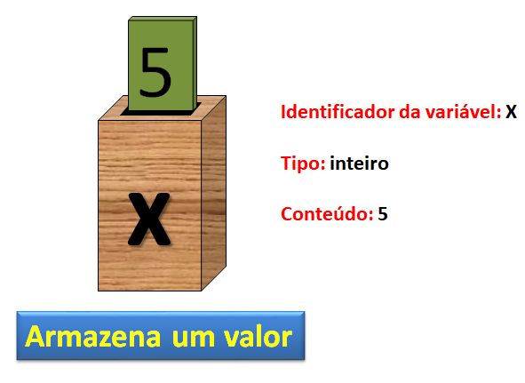
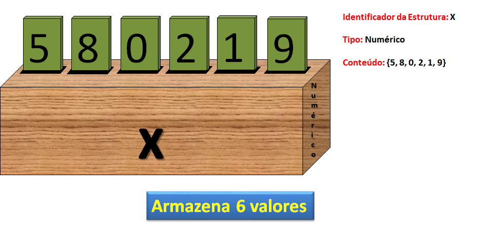
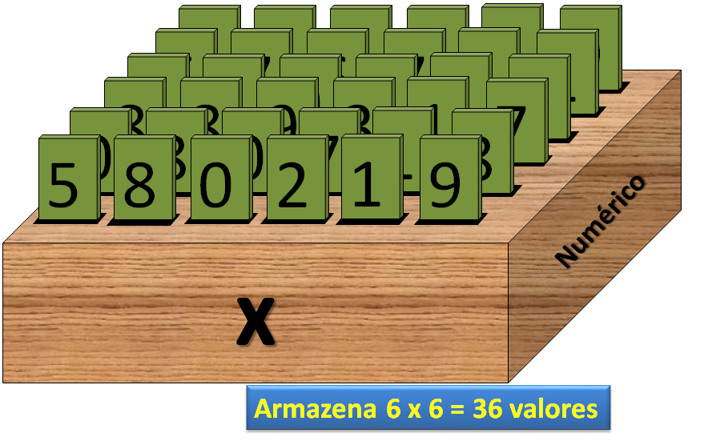

# Estrutura de dados

A  declaração  de  variáveis,  uma  a  uma,  é  suficiente  para  a  codificação  algorítmica  da solução  de  uma  ampla  gama  de  problemas, entretanto, esse tipo de declaração é insuficiente  para  resolver  um  grande número  de  problemas  computacionais.

A quantidade de tipos de dados primitivos (caractere, real, inteiro, lógico) não é suficiente para representar toda e qualquer informação que possa surgir. 

Assim, em muitas situações, esses recursos de representação são escassos, o que poderá ser suprimido se existisse mais tipos de dados ou, ainda melhor, se esses tipos pudessem ser construídos, à medida que fossem necessários.

Portanto, vamos construir novos tipos de dados a partir da composição de tipos primitivos já estudados. 

Esses novos tipos tem o formato denominado **estrutura de dados** que define como os tipos primitivos são organizados.

**Tipos básicos de estrutura no R**:

  * **Atomic vector**: homogêneo e unidimensional  
  * **Factor**: homogêmeo e unidimensional
  * **Matriz**: homogêneo e bidimensional  
  * **Array**: homogêneo e multidimensional  
  * **Lista**: heterogêneo  
  * **Data frame**: heterogêneo  


## Atomic vector

Atomic vectors são a estrutura de objetos mais simples do R, caracterizados por "não terem dimensão". Podem ser  vistos  como  uma  caixa  com  um  rótulo ou  nome  colado  a  ela, que  num  dado  instante  guarda  um  determinado  objeto, essa  caixa  pode  ter  seu  conteúdo  alterado  diversas  vezes.

Tipos de atomic vectos:

  *  lógico
  *  integer
  *  double
  *  complexo
  *  character


```{r echo=FALSE, fig.cap="O objeto identificado como X possui um tipo numérico inteiro cujo valor é 5.",fig.align='center',out.width = "600px"}

```

```{r}
(meu_inteiro <- 5)
(meu_double <- 8.50)
(meu_logico <- TRUE)
(meu_char <- "A")
```

De forma análoga, no conceito de estrutura de dados uma caixa poderá  comportar não apenas uma e somente uma informação, a caixa comportará um conjunto de dados, desde que previamente organizada, ou seja, dividida em compartimentos. A  função `c()`, o c é de *concatenate* utilizada para criação de um atomic vector com mais de um valor.

```{r echo=FALSE, fig.cap="O objeto identificado como X possui um tipo numérico inteiro cujos valores são 5, 8, 0, 2, 1 e 9.",fig.align='center',out.width = "600px"}

```
```{r}
X <- c(5,8,0,2,1,9)
Y <- c(0.5, 0.8, 1.5, 6.8)
L <- c(TRUE, FALSE, T, F)
M <- c("A", "mais", "bonita")
```

As funções `class()` e `mode()` auxiliam na determinação do tipo de objeto.

```{r}
class(X)
mode(X)
class(M)
mode(M)
```


**Observação:** Coerção ocorre quando dois tipos de objetos são inseridos uma estrutura homogênea (atomic vectors, arrays ou matrizes), o R converterá o objeto para o tipo mais flexível, na ordem:

1-Lógico

2-Inteiro

3-Double

4-Caracter

```{r}
c(T,3,5.5,"bela")
c(T,3,5.5)
```

## Factor

**Factors** ou simplesmente **Fatores** são utilizados para armazernar dados categorizados e são caracterizados por conterem apenas valores pré-definidos, chamados de níveis do fator (`levels`) e se basearem num vetor de inteiros.

Dentro do objeto, os levels são organizados em ordem alfabética.

```{r}
# Função factor
trat<-factor(c("T1","T1","T1","T2","T2","T2","T3","T3","T3"))
trat

# Função gl (Generate factors levels)
TRAT <- gl(3,3, labels = c("T1","T2","T3") )
TRAT

# Extraindo o níveis de um fator
levels(trat)
```

## Matrizes e Arrays

Matrizes e arrays são definidos usando as funções `matrix()` e `array()`, respectivamente. São multidimensionais. No caso da matriz esses objetos tem 2 dimensões e os compartimentos podem estar arranjados dessa maneira:


```{r echo=FALSE, fig.cap="O objeto identificado como X possui um tipo numérico inteiro bidimensional organizado na forma matricial com 6 linhas e 6 colunas totalizando 36 elementos.",fig.align='center',out.width = "600px"}

```

No R dois argumentos são utilizados na função `matrix()` um para determinar o número de colunas e a forma com a qual será o preeenchimento dos elementos na matriz, por linha (`byrow=FALSE`, default) ou por coluna (`byrow=TRUE`). 

Compare as duas matriz produzidas no exemplo abaixo.

Preenchimento da matriz por coluna.

```{r}
mat1 <- matrix(1:36, ncol = 6, byrow = FALSE)
mat1
```

Preenchimento da matriz por linha.

```{r}
mat2 <- matrix(1:36, ncol = 6, byrow = TRUE)
mat2
```


Arrays são objetos que podem conter dois ou mais dados bidimensionais. Por exemplo, em matrizes quadradas podem conter duas linhas e duas colunas e a dimensão pode ter cinco. 

Os arrays podem armazenar os valores tendo apenas um tipo semelhante de tipos de dados. Os dados podem ser mais de uma dimensão, onde existem linhas e colunas e dimensões de algum comprimento.

A função `array()` possui dois argumentos, `data` que receberá o vetor contendo os elementos e `dim` que receberá um vetor decrevendo o tamanho de cada dimensão.

Vamos criar um array com duas matrizes de 4 linhas e 3 colunas:

```{r}
meu_array <- array(1:24, c(4,3,2))
meu_array
```

Os nomes das linhas, colunas e matrizes do array podem ser definidos a partir de uma lista aplicada ao argumento `dimnames` da função `array()`, como apresentado abaixo:

```{r}
linhas <- c("Lin1", "Lin2", "Lin3", "Lin4")
colunas <- c("Col1","Col2","Col3")
matrizes<- c("Matriz1", "Matriz2")
meu_array <- array(1:24, c(4,3,2), dimnames = list(linhas,colunas, matrizes) )
meu_array
```


Para saber qual é o tipo de um objeto, vamos utilizar as funções `typeof()` e `class`.

```{r}
# Array
typeof(meu_array)
class(meu_array)

# Matriz
typeof(mat1)
class(mat1)

# Fator
typeof(trat)
class(trat)

# Atomic vector
typeof(Y)
class(Y)
```

As funções `length()`, `dim()`, `nrow()` e `ncol()` são usadas para determinar o comprimento de cada dimensão de um objeto. Observe que *atomic vector* e *factor* são estruturas unidimensionais, assim, somente a função `length()` retornará o número de elementos do objeto, e as demais função retornarão valor nulo *NULL*. 

```{r}
# Array
length(meu_array)
dim(meu_array)
nrow(meu_array)
ncol(meu_array)

# Matriz
length(mat1)
dim(mat1)
nrow(mat1)
ncol(mat1)

# Fator
length(trat)
dim(trat)
nrow(trat)
ncol(trat)

# Atomic vector
length(Y)
dim(Y)
nrow(Y)
ncol(Y)

```


Todos os objetos apresentados até agora (*atomic vector, factor, matrix* e *arrays*) podem ser classificados como estruturas de dados **HOMOGÊNEA**, pois são compostas por variáveis do mesmo tipo primitivo.

```{r echo=FALSE, fig.cap="Estrutura de dados Homogênea é uma coleção de variáveis de mesmo tipo, acessíveis com um único nome e armazenados contiguamente (um após o outro) na memória.",fig.align='center',out.width = "400px"}

```
Se um conjunto homogêneo de dados é composto por variáveis do mesmo tipo, um conjunto **HETEROGÊNEO** de dados é composto por elementos que não são do mesmo tipo primitivo. 

No R temos as **listas** e os **data frames**.


```{r echo=FALSE, fig.cap="As estruturas heterogêneas constituem um recurso importante para a organização dos dados utilizados devido à possibilidade de tratar um grupo de valores como uma única variável, similar às estruturas homogêneas.",fig.align='center',out.width = "400px"}

```

## Listas

São estrutras de dados heterogêneas, ou seja, podem ser formadas por vetores de **diferentes tipos de dados** e de **diferentes comprimentos**. Em R são frequentemente utilizadas para a passagem de vários argumentos de controle dentro de uma função.

Começaremos criando uma lista que consiste em três partes: 4 informações de caracteres em um vetor denominado **a**, 8 informações numéricas em um vetor denominado **b** e 3 informações lógicas em um vetor denominado **c**:

```{r}
a<-c("a","b","c","d")
b<-c(1,2,3,4,4,3,2,1)
c<-c(T,T,F)
```

Agora vamos utilizar a função `list()` para agrupar esses objetos.

```{r}
minha_lista <- list(a,b,c)
minha_lista
```

As funções `typeof()` e `class` retornam *list* e a função `length` retorna o número de *atomic vectors* utilizados na criação da lista. Funções como `dim()`, `nrow()` e `ncol()` retornarão *NULL*.

```{r}
typeof(minha_lista)
class(minha_lista)
length(minha_lista)
```

Para conseguirmos o número de elementos em cada objeto dentro da lista, poderemos utlizar a função `lapply()` junto com a função `length()`. 

```{r}
lapply(minha_lista,length)
```

A função `lapply`  pode ser utilizada juntamente com `typeof` e/ou `class`.

```{r}
lapply(minha_lista,typeof)
```


## Data frames

Semelhantes às listas, os *data frames* São estrutras de dados heterogêneas, que podem ser formadas por vetores de **diferentes tipos** de dados, contudo,  **todos os vetores têm o mesmo comprimento**. São definidos usando a função `data.frame()`.

Um data frame é um objeto com linhas e colunas (parecido com a matriz). As linhas de um data frame contêm diferentes observações do estudo em questão, denominadas **registros**. 

As colunas, por sua vez, contêm os valores de diferentes variáveis. Os valores no corpo de uma matriz podem ser apenas números; aqueles em um data.frame também podem ser números, mas também podem ser texto (por exemplo, os nomes dos níveis de fator para variáveis categóricas, como *masculino* ou *feminino* em uma variável chamada gênero), eles podem ser datas do calendário (por exemplo, *05/01/21*) , ou podem ser variáveis lógicas (*TRUE* ou *FALSE*).

A etapa mais importante do Data Science é obter o data frame absolutamente correto. 

A expectativa é que você tenha usado uma planilha eletrônica, como o Excel, para inserir e editar os dados e o que requer alguma prática é aprender exatamente como colocar seus números na planilha. 

Existem inúmeras maneiras de fazer errado, mas apenas uma maneira de fazer certo. E esta não é a maneira que a maioria das pessoas acha intuitivamente a mais óbvia. O principal é o seguinte: **todos os valores da mesma variável devem estar na mesma coluna**.

Se você fez um experimento com três tratamentos (controle, pré-aquecido e pré-resfriado) e quatro medições por tratamento, pode parecer uma boa ideia criar a planilha como esta:
 
|**controle**|**pré-aquecido**|**pré-resfriado**
|:---|:---:|:---:
|6.1|6.3|7.1
|5.9|6.2|8.2
|5.8|5.8|7.3
|5.4|6.3|6.9

No entanto, este não é um data frame, pois os valores da variável resposta aparecem em três colunas diferentes, em vez de todos na mesma coluna. 

A forma correta de inserir esses dados é ter duas colunas: uma para a variável **resposta** e outra para os **níveis do fator** experimental denominada Tratamento (controle, pré-aquecido e pré-resfriado). 

Aqui estão os mesmos dados, inseridos corretamente como um data.frame:

|**Resposta**|**Tratamento**
|:---|:---:
|6.1|controle
|5.9|controle
|5.8|controle
|5.4|controle
|6.3|pré-aquecido
|6.2|pré-aquecido
|5.8|pré-aquecido
|6.3|pré-aquecido
|7.1|pré-resfriado
|8.2|pré-resfriado
|7.3|pré-resfriado
|6.9|pré-resfriado

Para construir esse data frame, primeiramente vamos criar os distintos vetores, numérico e fator.
```{r}
Resposta <- c(6.1,5.9,5.8,5.4,6.3,6.2,5.8,6.3,7.1,8.2,7.3,6.9)
Tratamento <- gl(3,4,labels = c("controle","pré-aquecido","pré-resfriado") )
```

Agrora vamos agrupar esses vetores em um data frame denomidao `dados`.
```{r}
dados <- data.frame(Resposta, Tratamento)
dados
```

Agora vamos extrair algumas informações a respeito desse data frame:

Utilize a função `length()` para retornar o número de vetores (colunas) utilizados para criação do data frame.
```{r}
length(dados)
```

A função `dim()` retornará o número de linhas e o número de colunas do objeto, em analogia, poder-se-ia utilizar as funções `nrow()` e `ncol()`.
```{r}
dim(dados)
nrow(dados)
ncol(dados)
```

A função `glimpse()` do pacote `dplyr` fornece um resumo rápido a erspeito do data frame, semelhante à função, já estudada `str()`:

Observe que vamos chamar a função `glimpse` utilizado o `::` definindo anteriormente o nome do pacote `dplyr` na qual ela se encontra, sem a necessidade prévia de carregarmos esse pacote no ambiente de trabalho do R.

```{r}
dplyr::glimpse(dados)
```

A função `names()` retorna o nome das colunas (vetores) de um data frame.
```{r}
names(dados)
```

A função `names()` também pode ser utilizada para atribuir/modificar os nomes das colunas do data frame.
```{r}
names(dados) <- c("Altura_cm", "Método")
dados
```

O ponto principal sobre como trabalhar efetivamente com data frames é entendermos o uso de subscritos (ou indexação). No R, os subscritos aparecem entre colchetes `[ , ]`. 

Lembre-se que um data frame é um objeto bidimensional, compreendendo linhas e colunas. As linhas são referenciadas pelo primeiro subscrito (à esquerda da vírgula) , as colunas pelo segundo subscrito (à direita da vírgula). Portanto, para extrairmos a segunda observação da variável resposta `Altura_cm` usamos: 
```{r}
dados[2,1]
```

Observe que o retorno foi um *atomic vector* (vetor).


Para extrairmos um subconjuto desse data.frame, composto somente pelos valores de altura referentes ao método `pré-aquecido` (linhas 5 a 8), vamos utilizar os `:`, deixando o índice das colunas em branco na indexação. 
```{r}
dados[5:8,]
```
Observe que o retorno foi um outro data frame.

Se o objetivo for apenas os valores numéricos dos `pré-aquecidos`, temos. 
```{r}
dados[5:8,1]
```
Observe que o retorno foi um atomic vector.


Poderíamos extrair todos os valores a partir do operador de acesso de coluna `$`, chamando primeiramente o objeto e em seguida o nome da coluna. O retorno sempre será um vetor.

```{r}
dados$Altura_cm
```

Observe a diferença no retorno das diferentes formas de acesso a uma coluna. No caso abaixo, vamos acessar a coluna `Altura_cm`, cujo retorno será um vetor, semelhante ao exemplo anterior.
```{r}
dados[,1]
```

Compare com extração abaixo, nesse caso, temos como retorno um data frame.
```{r}
dados[1]
```

Transformações nos dados podem ser realizadas utilizando esse memso operador (`$`), por exemplo, vamos criar uma nova variável denominada `Altura_m` a partir da `Altura_cm`, dividindo cada um de seus valores por 100.

```{r}
dados$Altura_m <- dados$Altura_cm / 100 
dados
```

Agora criaremos a coluna `Bloco` para identificação dos blocos do experimento.

```{r}
dados$Bloco <- gl(4, 1, 12, labels = c("I","II","III","IV"))
dados
```

Agora podemos modificar a posição das colunas dentro do data frame. Ou seja, vamos "reciclar" o objeto `dados`  guardando esse novo data frame no mesmo identificador. 

```{r}
dados <- dados[,c(2,4,1,3)]
dados
```

Agora devemos criar uma coluna para a identificação ($ID$) para cada observação.

```{r}
dados$ID <- paste("obs", 1:nrow(dados), sep="_" )
dados
```

E vamos reordenar o data frame por `Altura_cm` da menor para a maior (utilize a função `order()`), em seguida, da maior para a menor nota (argumento `decreasing = T`).

```{r}
# Classificação do menor para o maior
dados[order(dados$Altura_cm),]

# Classificação do maior para o menor
dados[order(dados$Altura_cm,decreasing=TRUE),]
```


