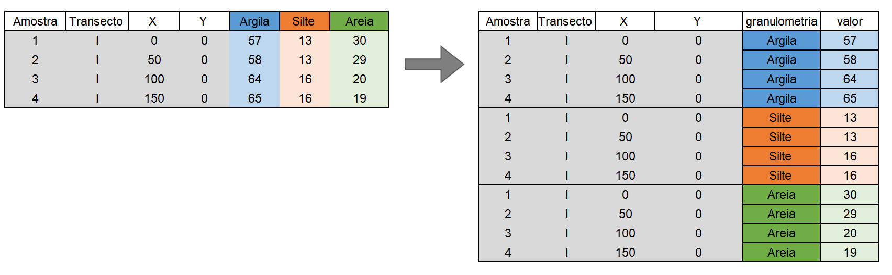

# Análise Exploratória de Dados (AED)

A AED não é um processo com um conjunto de regras rígidas. Mais do que qualquer coisa, é uma estado de espírito. Durante as fazes iniciais de AED, devemos ser livres para investigar cada ideia que ocorra.

À medida que a exploração segue, nos direcionamos para algumas áreas particularmente produtivas que, por fim, deverão ser escritas e comunicadas.

É considera uma fase importante de qualquer análise, pois mesmo se as perguntas já foram formuladas, sempre será necessário pesquisar a qualidade dos dados que temos em mãos.

Assim, a limpeza de dados é apenas uma aplicação da AED, na qual serão necessárias as ferramentas de visualização, transformação e modelagem.

A AED é o cálculo das estatísticas tradicionais, alguns exemplos:

  * Univariadas: média, mediana, desvio padrão, 1º e 3º quartis, mínimo, máximo, coeficientes die variação, de assimetria e curtosis, histogramas, boxplot, gráficos de regressão, gráficos de dispersão, entre outros.

  * Bivariadas – análise de `cluster`, análise de componentes principais, análise de fatores e análise de variância.
  
  
## Algumas funções de resumo

Aliadas à média e à contagem, várias outras funções podem ser utilizadas em R.

*Medidas de localização*

A função `median()` retorna a mediana do conjunto de dados, ou seja,  um valor onde $50\%$ de $x$ está acima e $50\%$ está abaixo dela. Já a média `mean()` é a soma dividida pelo comprimento. Assim, a mediana não é influenciada por valores extremos, diferente da média. Compare a diferença entre média e mediana para as variáveis `ARGILA` e em seguida `P`.

$$
\tilde{x} = \begin{cases}

\text{Se n é ímpar, n=2k+1, então } x_{(k+1)} \\
\text{Se n é par, n=2k, então } \frac{x_{(k)} + x_{(k+1)}}{2}  
\end{cases}

$$

**Entrada de dados**

```{r}
library(tidyverse)
URL <- "https://raw.githubusercontent.com/arpanosso/r_data_science_fcav/master/dados/geomorfologia.txt"
geomorfologia<-read.table(URL,header = TRUE)
```


**ARGILA**
```{r,message=FALSE}
# Para Argila
geomorfologia %>% 
  group_by(SUP) %>% 
  summarize(Media = mean(ARGILA, na.rm = TRUE),
            Mediana = median(ARGILA, na.rm = TRUE))
```

```{r}
geomorfologia %>% 
  ggplot(aes(x=ARGILA,fill=SUP)) +
  geom_histogram(bins=15,color="black")+
  facet_wrap(~SUP,scales="free")
```


**Fósforo (P)**
```{r,message=FALSE}
# Para P
geomorfologia %>% 
  group_by(SUP) %>% 
  summarize(Media = mean(P, na.rm = TRUE),
            Mediana = median(P, na.rm = TRUE))
```
```{r}
geomorfologia %>% 
  ggplot(aes(x=P,fill=SUP)) +
  geom_histogram(bins=15,color="black")+
  facet_wrap(~SUP,scales="free")
```

*Medidas de dispersão*

O desvio padrão `sd()` é a medida de dispersão padrão. Outras medidas podem ser utilizadas, como a variação interquartil `IQR()` e o desvio absoluto médio `mad()` são equivalentes robustos que podem ser mais úteis se você tiver outliers.
```{r,message=FALSE}
# Para P
geomorfologia %>% 
  group_by(SUP) %>% 
  summarize(Media = mean(P, na.rm = TRUE),
            Mediana = median(P, na.rm = TRUE),
            DP=sd(P, na.rm = TRUE),
            IQR=IQR(P, na.rm = TRUE),
            DA_mediano = mad(P, na.rm = TRUE))
```


*Medidas de classificação*

São os valores mínimo/máximo e os quantis. Quantis são generalizações da mediana. Por exemplo, `quantile(x, 0.25)` encontrará o valor de `x` que é maior que $25\%$ dos valores e menor do que os $75\%$ restantes. Já `quantile(x, 0.75)` encontrará o valor de `x` que é maior que $75\%$ dos valores e menor do que os $25\%$ restantes.

```{r,message=FALSE}
# Para P
geomorfologia %>% 
  group_by(SUP) %>% 
  summarize(Media = mean(P, na.rm = TRUE),
            Mediana = median(P, na.rm = TRUE),
            DP=sd(P, na.rm = TRUE),
            IQR=IQR(P, na.rm = TRUE),
            DA_mediano = mad(P, na.rm = TRUE),
            Mínimo = min(P, na.rm = TRUE),
            Q1 = quantile(P, 0.25, na.rm = TRUE),
            Q3 = quantile(P, 0.75, na.rm = TRUE),
            Máximo = max(P, na.rm = TRUE)) 
```

*Contagens*

Vamos agora contar o número de observações e o número de valores não faltantes, utilizando as funções `n()` e `sum(!is.na(x))`:

```{r,message=FALSE}
# Para P
geomorfologia %>% 
  group_by(SUP) %>% 
  summarize(Media = mean(P, na.rm = TRUE),
            Mediana = median(P, na.rm = TRUE),
            DP=sd(P, na.rm = TRUE),
            IQR=IQR(P, na.rm = TRUE),
            DA_mediano = mad(P, na.rm = TRUE),
            Mínimo = min(P, na.rm = TRUE),
            Q1 = quantile(P, 0.25, na.rm = TRUE),
            Q3 = quantile(P, 0.75, na.rm = TRUE),
            Máximo = max(P, na.rm = TRUE),
            N=n(),
            N_na = sum(!is.na(P))) 
```

Contagens e proporções de valores lógicos `sum(x > 10)`, `mean(y == 0)`. Quando usado com funções numéricas, `TRUE` é convertido em $1$, e `FALSE` em $0$. Isso  torna `sum()` e `mean()` muito úteis: `sum(x)` retorna o número de `TRUE` em x e `mean(x)` retorna a proporção de valores verdadeiros. 

Por exemplo, em cada supefície geomórfica, vamos calcular o número e a proporção de valores de tor de fósforo disponível no solo (`P`) inferiores a 10 $mg /dm^3$.

```{r,message=FALSE}
# Para P
geomorfologia %>% 
  group_by(SUP) %>% 
  summarize(Media = mean(P, na.rm = TRUE),
            Mediana = median(P, na.rm = TRUE),
            DP=sd(P, na.rm = TRUE),
            IQR=IQR(P, na.rm = TRUE),
            DA_mediano = mad(P, na.rm = TRUE),
            Mínimo = min(P, na.rm = TRUE),
            Q1 = quantile(P, 0.25, na.rm = TRUE),
            Q3 = quantile(P, 0.75, na.rm = TRUE),
            Máximo = max(P, na.rm = TRUE),
            N=n(),
            N_na = sum(!is.na(P)),
            n10=sum(P<10),
            n10p=mean(P<10)) 
```

*Medidas da Forma da Distribuição*

As medidas da forma da distribuição são os coeficientes de assimetria e curtose.

**Assimetria** - é uma medida da simetria da distribuição de frequência. Ela mostra se os desvios da média são maiores para um lado da distribuição do que para o outro. Usualmente, a estimativa do Coeficiente de Assimetria pode ser calculada pela fórmula:

$$
G_1 = \frac{n}{(n-1)(n-2)} \cdot \frac{\sum_{i=1}^n(x_i - \bar{x})^3}{s^3}
$$

Vamos utilizar a função `skewness()` do pacote `agricolae` para calcular o coeficente de assimetria.

```{r,message=FALSE}
# Para P
geomorfologia %>% 
  group_by(SUP) %>% 
  summarize(Media = mean(P, na.rm = TRUE),
            Mediana = median(P, na.rm = TRUE),
            DP=sd(P, na.rm = TRUE),
            IQR=IQR(P, na.rm = TRUE),
            DA_mediano = mad(P, na.rm = TRUE),
            Mínimo = min(P, na.rm = TRUE),
            Q1 = quantile(P, 0.25, na.rm = TRUE),
            Q3 = quantile(P, 0.75, na.rm = TRUE),
            Máximo = max(P, na.rm = TRUE),
            N=n(),
            N_na = sum(!is.na(P)),
            n10=sum(P<10),
            n10p=mean(P<10),
            G1 = agricolae::skewness(P)) 
```

Se as observações apresentam distribuição simétrica temos $G_1=0$, ou próximas a $0$.

O coeficiente de assimetria é o indicativo mais comum de Normalidade. Em dados assimétricos, existem dúvidas sobre qual medida de tendência central devemos utilizar para resumir os dados. Nesses casos, comparações entre médias de diferentes conjuntos de observações são não confiáveis, uma vez que a variância pode diferir substancialmente de um conjunto de observações para outro.

```{r}
geomorfologia %>% 
  ggplot(aes(x=P,y=..density..)) + 
  geom_histogram(bins=30, color="black", fill="white")+
  facet_wrap(~SUP, scales = "free")+
  geom_density(alpha=0.1,fill="red")
```


**Curtose** - Indica o grau de achatamento de uma distribuição, é a medida do peso das  caudas da distribuição. Se as observações seguem uma distribuição normal, então o coeficiente de curtose é zero, e sua estimativa é dado por: 

$$
G_2 = \frac{\frac{\sum{i=1}^n(x-\bar{x})^4}{s^4}}{(n-3)(n-2)(n-1)}-3 \cdot \frac{(n-1)^2}{(n-2)(n-3)}
$$

Vamos utilizar a função `kurtosis()` do pacote `agricolae` para calcular o coeficente de curtose.

```{r,message=FALSE}
# Para P
geomorfologia %>% 
  group_by(SUP) %>% 
  summarize(Media = mean(P, na.rm = TRUE),
            Mediana = median(P, na.rm = TRUE),
            DP=sd(P, na.rm = TRUE),
            IQR=IQR(P, na.rm = TRUE),
            DA_mediano = mad(P, na.rm = TRUE),
            Mínimo = min(P, na.rm = TRUE),
            Q1 = quantile(P, 0.25, na.rm = TRUE),
            Q3 = quantile(P, 0.75, na.rm = TRUE),
            Máximo = max(P, na.rm = TRUE),
            N=n(),
            N_na = sum(!is.na(P)),
            n10=sum(P<10),
            n10p=mean(P<10),
            G1 = agricolae::skewness(P),
            G2 = agricolae::kurtosis(P)) 
```
  
  
```{r}
geomorfologia %>% 
  ggplot(aes(x=P,y=..density..)) + 
  geom_histogram(bins=30, color="black", fill="white")+
  facet_wrap(~SUP, scales = "free")+
  geom_density(alpha=0.1,fill="red")
```
  

## Descrição gráfica

Visualizar a distribuição de uma variável dependerá se a variável é **categórica** ou **contínua**. Uma variável **categórica** só pode assumir um pequeno conjunto de valores. Em R essas variáveis são geralmente salvas na forma de *fatores* ou *strings*.


**Importação dos dados** 

Vamos realizar a importação, via web, do banco de dados [transectos.txt](https://raw.githubusercontent.com/arpanosso/r_data_science_fcav/master/dados/transectos.txt).

```{r}
URL <- "https://raw.githubusercontent.com/arpanosso/r_data_science_fcav/master/dados/transectos.txt"
transectos<-read.table(URL,header = TRUE)
glimpse(transectos)
```

As colunas `X` e `Y` denotam as coordenadas de cada ponto amostral dentro do gradeado experimental. Vamos vizualizar o gradeado.

```{r}
transectos %>% 
  ggplot(aes(x=X, y=Y))+
  geom_point(size=2)+
  theme_minimal()
```


```{r}
glimpse(transectos)
```

Agora, vamos criar um gráfico de barras para visualizar a variável categórica `Transecto`, ou seja, o número de observações em cada transecto.

```{r}
transectos %>% 
  ggplot(aes(x = Transecto))+
  geom_bar(fill="lightblue", color="black")
```

Muitas vezes precisamos modificar a escala dos eixos para melhorar e focar nossa visualização nas diferenças, então, vamos utilizar a função `coord_cartesian()`, aliada aos argumentos `xmin` e/ou `ymin`, ambos os argumentos deverãp receber um vetor com dois valores para a definição do menor e maior valor da escala:

```{r}
transectos %>% 
  ggplot(aes(x = Transecto))+
  geom_bar(fill="lightblue",color="black") +
  coord_cartesian(ylim= c(55,63))
```

Agora vamos visualizar a tabela com os valores contados.
```{r}
transectos %>% 
  count(Transecto)
```

Uma variável **contínua** pode assumir qualquer valor de um conjunto infinito de valores ordenados. Para examinarmos a distribuição de uma variável contínua, vamos utilizar o histograma.

**Argila**
```{r}
transectos %>% 
  ggplot(aes(x=Argila)) +
  geom_histogram(bins=20, color="black",fill="lightgray")
```

Podemos sobrepor vários histogramas no mesmo gráfico, para isso, utilize `geom_freqpoly()`. Observe que vamos criar os polígonos a partir da densidade e frequência $d_i$:

$$
d_i = \frac{f_i}{\Delta_i}
$$

onde,

$f_i$ é a frequência relativa dada pela contagem de cada classe individual $n_i$, dividida pelo número total de observações ($n$).

$$
f_i = \frac{n_i}{n}
$$

$\Delta_i$ é o intervalo de cada classe específica $i$.

```{r}
transectos %>% 
  ggplot(aes(x=Argila, color=Transecto, y= ..density..)) + 
  geom_freqpoly()
```

O histograma fornece informação sobre:  
  * Tipo de distribuição;  
  * Unimodal ou multimodal;  
  * Presença de valores extremos (outliers);  
  * Variabilidade.
  

Outra possibilidade é o uso do *Boxplot*, para isso vamos verificar a variável `Silte`:


```{r}
transectos %>% 
  ggplot(aes(y=Silte)) + 
  geom_boxplot()
```

Vamos modificar o gráfico, alterando as cores e a escala do eixo X para modificar a caixa.

```{r}
transectos %>% 
  ggplot(aes(y=Silte)) + 
  geom_boxplot(color="black",fill="lightblue")+
  coord_cartesian(xlim=c(-1,1))+
  theme_minimal()
```

Podemos construir o boxplot segmentado por transecto.

```{r}
transectos %>% 
  ggplot(aes(y=Silte, x=Transecto, fill=Transecto)) + 
  geom_boxplot()
```


Para facilitar a visualização da tendência, pode-se reordenar `Transecto` com base no valor médio da variável estudada (teor de silte do solo, no caso).

```{r}
transectos %>% 
  ggplot(aes(y=Silte, x=reorder(Transecto,Silte,mean), fill=Transecto)) + 
  geom_boxplot()
```

Se temos nomes longos, podemos rotacionar o gráfico 90º com `coord_flip()`.

```{r}
transectos %>% 
  ggplot(aes(y=Silte, 
             x=reorder(Transecto, Silte, mean), 
             fill=Transecto)) + 
  geom_boxplot()+
  coord_flip()
```

**Violin plot**

O violin plot é um método de visualizar dados numéricos. É semelhante ao boxplot, com a adição de um gráfico de densidade girado em cada lado. Essa representação, portanto, também mostram a densidade de probabilidade dos dados em valores diferentes. 

Normalmente, um gráfico de violino incluirá todos valores que estão no boxplot: um marcador para a mediana dos dados, uma caixa ou marcador indicando o intervalo interquartil e, possivelmente, todos os pontos de amostra, se o número de amostras não for muito alto. A diferença é particularmente útil quando a distribuição de dados é multimodal (mais de um pico). Neste caso, um gráfico de violino mostra a presença de diferentes picos, sua posição e amplitude relativa.

```{r}
transectos %>% 
  ggplot(aes(y=Silte, 
             x=reorder(Transecto, Silte, mean), 
             fill=Transecto)) + 
  geom_violin(trim = FALSE)+
  stat_summary(fun = median, geom = "point", shape=21, size=3, color="black", fill="gray") +
  theme(legend.position="none")
```

A densidade de distribuição dos pontos pode ser visualizada com a função `geom_dotplot()` par aa apresentação dos pontos amostrais.

```{r,message=FALSE,error=FALSE}
transectos %>% 
  ggplot(aes(x=Transecto,y=Silte))+
  geom_violin(trim = FALSE) +
  geom_dotplot(binaxis='y', stackdir='center', dotsize=1)
```

Muitas vezes, podemos mesclar o **boxplot** com o **violin plot**. A largura das caixas do boxplot pode ser controlada com o argumento `width`.

```{r}
transectos %>% 
  ggplot(aes(y=Silte, 
             x=reorder(Transecto, Silte, mean), 
             fill=Transecto)) + 
  geom_violin(trim=FALSE, fill="lightgray")+
  geom_boxplot(width=0.1)+
  theme_classic()
```

**Função Densidade Acumulada Empírica**

A função de distribuição cumulativa empírica (*empirical cumulative distribution function * - ECDF) fornece uma visualização alternativa da distribuição. Em comparação com outras visualizações que dependem da densidade (como `geom_histogram()`), o ECDF não requer nenhum parâmetro de ajuste e lida com variáveis contínuas e categóricas.

A desvantagem é que requer mais treinamento para interpretar com precisão e as tarefas visuais subjacentes são um pouco mais desafiadoras.

A função de distribuição acumulada descreve como probabilidades são associadas aos valores ou aos intervalos de valores de uma variável aleatória. Ela representa a probabilidade de uma variável aleatória ser menor ou igual a um valor real $x$.  

$$
F(x) = P(X \le x)
$$
Em R pode ser desenhanda com `stat_ecdf()` 

```{r}
transectos %>% 
  ggplot(aes(x=Silte)) +
  stat_ecdf(geom = "line")
```
A representação pode ser segmentada por cada categoria da variável categórica.

```{r}
transectos %>% 
  ggplot(aes(x=Silte, color= Transecto)) +
  stat_ecdf(geom = "line")
```

As variáveis `Argila`, `Silte` e `Areia` são expressas em porcentagem, assim, poderíamos colocá-las em um mesmo gráfico e adicionar uma legenda para identificar cada uma delas. 

Podemos realizar essa tarefa utilizando a função `gather()` do pacote `tidyr`.

Literalmente essa função **empilha** o banco de dados. Nesse exemplo, vamos criar uma nova variável denominada `granulometria` que deverá receber repedidamente os nomes das colunas (`Areia`, `Silte` e `Argila`), preservando o valor numérico dessas variáveis que serão empilhados na nova variável `valor`, como exemlificado na figura abaixo:

```{r echo=FALSE, fig.cap="Exemplo simples do comportamento da função `gather()`.",fig.align='center',out.width = "800px"}

```
A função tem como argumentos os nomes das duas novas colunas `granulometria` e `valor`, sendo o  terceiro argumento um vetor identificando as posições das colunas que deverão ser empilhadas (`5:7`, no caso).

```{r}
transectos %>% 
  gather(granulometria, valor, 5:7) %>% 
  View()
```

Podemos completar o código acima pedindo a partir do `ggplot()` o boxplot por granulometria em cada posição de X, por exemplo:


```{r}
transectos %>% 
  gather(granulometria, valor, 5:7) %>% 
  ggplot(aes(y=valor, x=as.factor(X),fill=granulometria)) +
  geom_boxplot()+
  theme(axis.text.x=element_text(angle=90, hjus=1,size = rel(0.8)))
```

Ou, podemos pedir para cada transecto `Y`, no caso:

```{r}
transectos %>% 
  gather(granulometria, valor, 5:7) %>% 
  ggplot(aes(y=valor, x=as.factor(Y),fill=granulometria)) +
  geom_boxplot()+
  theme(axis.text.x=element_text(angle=90, hjus=1,size = rel(0.8)))
```

## Aplicação de modelos

Até agora para a análise exploratória dos dados recomendamos o cálculo de vparias medidas de dispersão e posição, e a representação gráfica, que nos auxiliará na interpretação da forma da distribuição dos dados. O próximo passo é adicionarmos um modelo matemático que descreva o comportamento do dados.


Agora vamos aplicar a estimativa da densidade alisa `geom_density()` ao nosso histograma.

```{r}
transectos %>% 
  ggplot(aes(x=Silte,y=..density..)) +
  geom_histogram(bins=20, color="black",fill="lightgray") +
  geom_density(linetype=2,col="blue", lwd=1)
```

 **Hipóteses estatísticas do teste da normalidade dos dados**

$$
\begin{cases}
H_0: \text{Os dados tem distribuição normal }[X \sim N(\mu,\sigma^2) ]\\
H_1: \text{Os dados não tem distribuição normal}
\end{cases}
$$
Todo teste estatístico fornece os valores da estatística do teste e o valor de probabilidade associado a essa estatística $p$, por exemplo:
```{r}
silte <- transectos$Silte 
shapiro.test(silte)
```


**Regra de decisão** ($\alpha=0,01$ ou $1\%$)   

  *Se o valor de $p \ge 0,01$, o teste é não significativo, portanto não rejeitamos $H_0$, e concluímos que os dados suportam a hipótese de uma distribuição normal teórica.
  
  *Se $p \le 0,01$, o teste é significativo, portanto rejeitamos $H_0$, tomamos $H_1$ como verdadeira e concluímos que os dados não suportam a suposição de normalidade.

Um gráfico quantil-quantil (ou QQPlot, `stat_qq()`) é usado para verificar se uma dada variável segue a distribuição normal. Os dados são considerados normalmente distribuídos quando os pontos seguem aproximadamente a linha de referência de 45º (1:1, `stat_qq_line()`). 

```{r}
transectos %>% 
  ggplot(aes(sample = Silte))+
  stat_qq(color="blue") +
  stat_qq_line(color="red")
```
Uma vez que os dados seguem a distribuição normal, podemos adicionar ao histograma da variável a curva teórica.

Para sobrepor a curva da função, adicionamos a opção `stat_function(fun = dnorm)` e especificamos a forma usando os argumentos `mean = mean(silte)` e `sd = sd(silte)` que deve ser passado apra o argumento `args` na forma de uma lista `list()`. Se você tem dados ausentes, certifique-se de passar o argumento com `na.rm = TRUE` para os parâmetros de `mean` e `sd`. Finalmente, podemos alterar a cor usando o argumento `color = "red"`. 

```{r}
transectos %>% 
  ggplot(aes(x=Silte)) +
  geom_histogram(aes(y=..density..),bins=20, color="black",fill="lightgray") +
  stat_function(fun = dnorm, colour = "red",
                      args = list(mean = mean(silte, na.rm = TRUE),
                                 sd = sd(silte, na.rm = TRUE)))
```
Vamos salvar o gráfico em um novo plot.

```{r}
hist_silte <- transectos %>% 
  ggplot(aes(x=Silte)) +
  geom_histogram(aes(y=..density..),bins=20, color="black",fill="lightgray") +
  stat_function(fun = dnorm, colour = "red",
                      args = list(mean = mean(silte, na.rm = TRUE),
                                 sd = sd(silte, na.rm = TRUE)))
  
```


Para alterar os rótulos dos eixos, vamos apresentar uma nova opção. Nesse caso, usaremos as opções `scale_x_continuous` e `scale_y_continuous`, pois essas funões possuem outros argumentos de personalização para os eixos que usaremos a seguir. Em cada um, adicionamos o nome desejado ao argumento do nome como uma string.


```{r}
hist_silte + 
  scale_x_continuous(name = "Teor de Silte no solo\n(%)") +
  scale_y_continuous(name = "Densidade")
```
Observe que o `ggplot` também permite o uso de nomes de várias linhas (em eixos e títulos). Aqui, alteramos o rótulo do eixo x para que passe por duas linhas usando o caractere `"\n"` para quebrar a linha. 

Agora vamos fazer com que as marcações do eixo x apareçam a cada 2 unidades em vez de 5 usando o argumento `breaks = seq (4, 30, 2)` em `scale_x_continuous`.

```{r}
hist_silte + 
  scale_x_continuous(name = "Teor de Silte no solo\n(%)", 
                     breaks = seq (4, 30, 2)) +
  scale_y_continuous(name = "Densidade")
```

Você também pode adicionar um gradiente ao seu esquema de cores que varia de acordo com a frequência dos valores. Para fazer isso, alteramos o argumento `aes(y = ..count ..)` em `geom_histogram()` para `aes(fill = ..count..)`. 


```{r}
hist_silte + 
  geom_histogram(aes(fill = ..count..),bins=20)+
  scale_x_continuous(name = "Teor de Silte no solo\n(%)", 
                     breaks = seq (4, 30, 2)) +
  scale_y_continuous(name = "Densidade")
```

Podemos, personalizar o gradiente alterando as cores de ancoragem para alto e baixo. Para isso, adicionamos a opção `scale_fill_gradient` ao gráfico com os argumentos `Count` (o nome da legenda), `low` (a cor dos valores menos frequentes) e `high` (a cor dos valores mais frequentes). 

```{r}
hist_silte + 
  geom_histogram(aes(fill = ..count..),bins=20)+
  scale_x_continuous(name = "Teor de Silte no solo\n(%)", 
                     breaks = seq (4, 30, 2)) +
  scale_y_continuous(name = "Densidade") +
  scale_fill_gradient("Count", low="blue", high = "red")
```


Para representar os diferentes transectos acrescentamos na função `geom_histogram` um argumento `fill = Transecto` a `aes()`. Em segundo lugar, para ver mais claramente o gráfico, adicionamos dois argumentos, `position = "identity"` e `alpha = 0.6`. Isso controla a posição e a transparência das colunas, respectivamente. Finalmente, você pode personalizar as cores dos histogramas adicionando `scale_fill_brewer` ao gráfico do pacote` RColorBrewer`. 

```{r}
hist_silte + 
  geom_histogram(aes(fill = Transecto),bins=20,
                 position="identity", alpha=0.6)+
  scale_x_continuous(name = "Teor de Silte no solo\n(%)", 
                     breaks = seq (4, 30, 2)) +
  scale_y_continuous(name = "Densidade") +
  scale_fill_brewer(palette="Accent")
```

**Modelos de Distribuição – prós e contras**

Vantagens: 

  * fornece uma descrição da distribuição com poucos parâmetros (geralmente só dois).

Desvantagem:  

  * Distribuição Normal  ou lognormal muito raramente são encontradas nas ciências agrárias. 
  * Para análise exploratória de dados, modelos de distribuição, geralmente, não são necessários. 
  
## Exercícios
  
**1)** O conjunto de dados denominado de "BroomBarnFarm.txt" foi coletado em uma área de 80 ha no leste da Inglaterra. O solo foi amostrado em intervalos de 40 m. As amostras de solo na profundidade de 0,20 m foram analisadas em laboratório e como resultado temos: 435 valores para cada variável (K, pH e P). (WEBSTER & OLIVER. Geostatistics for Environmental Scientists, Appendix B).

Responda as seguintes questões:

a)	Calcular a média, a mediana, o desvio padrão, o 1º (Q1) e o 3º (Q3) quartis, os coeficientes de assimetria, de curtosis, de variação (CV), as observações máxima e mínima das 3 variáveis do conjunto de dados.

b)	Construa os gráficos Boxplot, histogramas e da função de distribuição acumulada empírica para as 3 variáveis. Discuta o que você observa.

c)	Refaça o item anterior com os dados na escala logarítmica. Discuta os resultados.

**2)** No arquivo **geomorfologia.txt** que possui dados de atributos de solo de um transecto existe uma coluna classificatória das superfícies geomórficas identificadas na área de estudo.

a)	Faça gráficos de dispersão dos dados das variáveis Arg, P e Ca para todo o transecto e, em seguida, para cada uma das 3 superfícies (I, II e III).

b)	calcule as estatísticas descritivas destas superfícies que foram identificadas na área (monte uma tabela com: o tamanho da amostra (n), a média, mediana, o desvio-padrão, os coeficientes de assimetria, curtose e de variação).

c)	faça gráficos (histogramas, boxplots para descrever as distribuições, quanto as formas, das três variáveis Arg, P e Ca para cada superfície.

