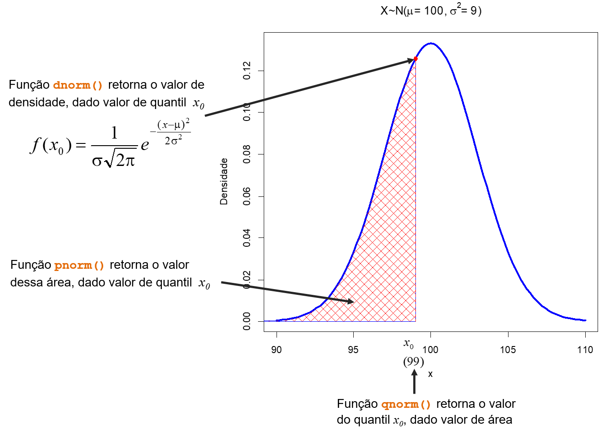

# Distribuição De Probabilidade

## Distribuição Normal

A exata curva de densidade para uma particular distribuição normal é descrita pela sua média $\mu$ e pelo seu desvio padrão $\sigma$, cuja função de densidade de probabilidade é dada por:

$$
f(x) = \frac{1}{\sigma \sqrt{2 \pi}}e^{-\frac{1}{2} \frac{(x-\mu)^2}{\sigma^2}}, -\infty < x < \infty
$$

A curva é totalmente caracterizada por $\mu$ e $\sigma$. Vamos utilizar a função `curve()` junto à função `dnorm()` para a construção da representação gráfica da distribuição normal. A função `dnorm()` retornará o valor de densidade de frequência, ou seja, $f(x)$ para uma média e desvio-padrão definidos em seus argumentos `mean` e `sd`, respectivamente.
```{r}
# Definião dos parâmteros
media <- 15
dp <- 3

# Construção da curva
curve(dnorm(x,mean=media,sd=dp),5,25,col="red")
```

A curva normal modela a distribuição de frequência de muitos eventos biológicos. Muitas das estatísticas utilizadas na inferência estatística seguem a distribuição normal. É a mais importante das distribuições contínuas por causa do seu papel na teoria amostral.

Como visto, a curva é simétrica é relação à média $\mu$ e tem área sob ela igual a $1$.

$$
\int_{-\infty}^{\infty} f(x) dx = 1
$$

Portanto, vamos adicionar uma linha no gráfico anterior, representando $\mu$.

```{r}
curve(dnorm(x,mean=media,sd=dp),5,25,col="red")
abline(v=media,lty=2)
```

Assim, a área (probabilidade) até o valor de $\mu$ é metade da área total, ou seja $0,5$. Vamos buscar esse valor com a função `pnorm()`, utiizando como argumento o valor do eixo x, aqui denominado `quantil` (`q`) desejado e os parâmetros média e desvio padrão. A função sempre retorna a área acumulada de $-\infty$ até o valor de `q`.
 
```{r}
pnorm(q=media, mean=media, sd=dp)
```
 
 
 Em outras palavras, calculamos $P(X<\mu)$
 
 Calcular a área entre os pontos de inflexão da curva, ou seja:
 
 $$
 \int_{\mu - \sigma}^{\mu+\sigma} f(x) dx = 0,6826895
 $$
 
```{r}
curve(dnorm(x,mean=media,sd=dp),5,25,col="red")
abline(v=media-dp,lty=2)
abline(v=media+dp,lty=2)
```
 Calcular a área entre:
 
 $$
 \int_{\mu - 2\sigma}^{\mu+2\sigma} f(x) dx = 0,9544997
 $$
 
```{r}
curve(dnorm(x,mean=media,sd=dp),5,25,col="red")
abline(v=media-2*dp,lty=2)
abline(v=media+2*dp,lty=2)
```

 Calcular a área entre:
 
 $$
 \int_{\mu - 3\sigma}^{\mu+3\sigma} f(x) dx = 0,9973002
 $$
 
```{r}
curve(dnorm(x,mean=media,sd=dp),5,25,col="red")
abline(v=media-3*dp,lty=2)
abline(v=media+3*dp,lty=2)
```

Qual o valor de $X$ que supera $65\%$ das observações, ou seja, qual o valor de $X$ cuja área até ele é $0,65$. Para isso, utilizaremos a função `qnorm()` que retornará o quantil dado a probabilidade acumulada até ele. 

```{r}
qnorm(0.65, media, dp)
```

Vamos tirar a prova:

```{r}
pnorm(16.15596,media,dp)
```

Dado a distribuição abaixo, calcular $P(X < 99)$

```{r echo=FALSE, fig.cap="Resumo do funcionamento das funções pnorm, qnorm e dnorm.",fig.align='center',out.width = "600px"}

```


**Estudo dos parâmetros**

O efeito da mudança dos parâmetros   $\mu$ e $\sigma$   na distribuição normal: 

**a)** Diferentes médias e mesmo desvio padrão.

```{r}
curve(dnorm(x,50,7),xlim=c(20,180),lwd=2,col=2,
	ylab="Densidade",xlab="Classes",cex.lab=1.3,las=1)
curve(dnorm(x,100,7),lwd=2,col=4,ylab="Densidade",add=TRUE)
curve(dnorm(x,150,7),lwd=2,col=3,ylab="Densidade",add=TRUE)
abline(h=0,col="gray",lwd=1.6)
text(c(50,100,150)+15,.02,expression(sigma==7),cex=1.6)
text(c(50,100,150),.0029,cex=1.3,
	expression(paste(mu[1]," = ",sep="",50),
		paste(mu[2]," = ",sep="",100),
		paste(mu[3]," = ",sep="",150))
)

```


**b)** Diferentes desvio padrões e a mesma média.

```{r}
curve(dnorm(x,50,7),xlim=c(20,80),lwd=2,col=2,ylim=c(0,0.06),
	ylab="Densidade",xlab="Classes",cex.lab=1.3,las=1)
curve(dnorm(x,50,11),lwd=2,col=1,ylab="Densidade",add=TRUE)
curve(dnorm(x,50,16),lwd=2,col=4,ylab="Densidade",add=TRUE)
abline(h=0,col="gray",lwd=1.6)
lines(c(50,50),c(0,dnorm(50,50,7)),col=1,lwd=2)
text(55,.002,expression(mu==50),cex=1.6)
text(c(56,63,75)+2,c(.05,.025,0.01),cex=1.4,
	expression(paste(sigma[1]," = ",7),
	paste(sigma[2]," = ",11),
	paste(sigma[3]," = ",16))
)
```

## Distribuição Normal Padronizada

É um caso particular da distribuição normal, quando a média é $0$ e o desvio padrão é $1$.

A transformação de qualquer variável pode ser realizada por meio de:

$$
Z =\frac{X-\mu}{\sigma}
$$

assim, 

$$
f(z) = \frac{1}{\sqrt{2\pi}} e^{-\frac{1}{2}(z)^2}
$$
Por meio da transformação, podemos calcular probabilidade.

$$
P(x_1 < X < x_2) = P(z_1 < Z < z_2) \\
com \\
z_1=\frac{x_1-\mu}{\sigma} \text{. e } z_2 = \frac{x_2-\mu}{\sigma}
$$

As funções `dnorm()`, `pnorm()` e `qnorm()` tem como valores *default* `mean = 0` e `sd = 1`, assim:

```{r}
curve(dnorm(x),-4,4,col="blue",xlab="Z")
abline(v=0,lty=2)
```

Calcular a área entre:
 
 $$
 \int_{-2}^{2} f(z) dz = 0,9544997
 $$
 
```{r}
curve(dnorm(x),-4,4,col="blue")
abline(v=-2,lty=2)
abline(v=2,lty=2)
```


Qual o valor de $Z$ que supera $97,5\%$ das observações, ou seja, qual o valor de $Z$ cuja área até ele é $0,975$. 

```{r}
qnorm(0.975)
```

Vamos tirar a prova:

```{r}
pnorm(1.96)
```

## Exercícios

**1)**Resolver no R e representar graficamente:
Se $X \sim N(\mu=13,\sigma^2=16)$, encontre:

**a)** $P(X < 20)$

**b)** $P(X >10)$

**c)** $P(10 < X < 20)$

**d)** $1- P(7< X < 19)$

**e)** $1- P(14< X < 16)$

```{r, echo=FALSE}
#a
x1<-20
curve(dnorm(x,13,sqrt(16)),0,26,
	ylab="Densidade",col=4,
	lwd=3,main="X ~ N(13,16)")
polygon(c(seq(-5,x1,0.01),x1),c(dnorm(seq(-5,x1,0.01),13,4),0), 
	col = "red", border = "blue",density=10)
lines(c(x1,x1),c(0,dnorm(x1,13,4)),
	col=2,lty=1)
abline(h=0,col="gray")
text(.6*x1,dnorm(.5*x1,13,4)*.5,
	paste(sep="","P(X<", x1,") = ",round(pnorm(x1,13,4),4)),cex=1.2)

#b
x1<-10
curve(dnorm(x,13,sqrt(16)),0,26,
	ylab="Densidade",col=4,
	lwd=3,main="X ~ N(13,16)")
polygon(c(seq(x1,38,0.01),38),c(0,dnorm(seq(x1,38,0.01),13,4)), 
	col = "red", border = "blue",density=10)
lines(c(x1,x1),c(0,dnorm(x1,13,4)),
	col=2,lty=1)
abline(h=0,col="gray")
text(1.6*x1,dnorm(.5*x1,13,4)*.5,
	paste(sep="","P(X>", x1,") = ",round(1-pnorm(x1,13,4),4)),cex=1.2)


#c
x1<-10
x2<-20
curve(dnorm(x,13,sqrt(16)),0,26,
	ylab="Densidade",col=4,
	lwd=3,main="X ~ N(13,16)")
polygon(c(x1,seq(x1,x2,0.01),x2),c(0,dnorm(seq(x1,x2,0.01),13,4),0), 
	col = "red", border = "blue",density=10)
lines(c(x1,x1),c(0,dnorm(x1,13,4)),
	col=2,lty=1)
lines(c(x2,x2),c(0,dnorm(x2,13,4)),
	col=2,lty=1)
abline(h=0,col="gray")
text(15,.02,
	paste(sep="","P(",x1,"< x <",x2,") = ",round(pnorm(x2,13,4)-pnorm(x1,13,4),4)),cex=1.2)

#d
x1<-7
x2<-19
curve(dnorm(x,13,sqrt(16)),0,26,
	ylab="Densidade",col=4,
	lwd=3,main="X ~ N(13,16)")
polygon(c(seq(-5,x1,0.01),x1),c(dnorm(seq(-5,x1,0.01),13,4),0), 
	col = "red", border = "blue",density=10)
polygon(c(x2,seq(x2,26,0.01),26),c(0,dnorm(seq(x2,26,0.01),13,4),0), 
	col = "red", border = "blue",density=10)
lines(c(x1,x1),c(0,dnorm(x1,13,4)),
	col=2,lty=1)
lines(c(x2,x2),c(0,dnorm(x2,13,4)),
	col=2,lty=1)
text(13,.02,
	paste(sep="","1-P(",x1,"< x <",x2,") = ",round(1-(pnorm(x2,13,4)-pnorm(x1,13,4)),4)),cex=1.2)
text(13,.013,
	paste(sep="","P(X<",x1," | X>",x2,") = ",round(pnorm(x1,13,4)+(1-pnorm(x2,13,4)),4))
	,cex=1.2)

#e
x1<-14
x2<-16
curve(dnorm(x,13,sqrt(16)),0,26,
	ylab="Densidade",col=4,
	lwd=3,main="X ~ N(13,16)")
polygon(c(x1,seq(x1,x2,0.01),x2),c(0,dnorm(seq(x1,x2,0.01),13,4),0), 
	col = "red", border = "blue",density=10)
lines(c(x1,x1),c(0,dnorm(x1,13,4)),
	col=2,lty=1)
lines(c(x2,x2),c(0,dnorm(x2,13,4)),
	col=2,lty=1)
abline(h=0,col="gray")
text(15,.02,
	paste(sep="","P(",x1,"< x <",x2,") = ",round(pnorm(x2,13,4)-pnorm(x1,13,4),4)),cex=1.2)


```

**2)** Seja $Z$ uma variável aleatória com distribuição normal padrão $[Z \sim N(0,1)]$ determine o valor de $t$ tal que.

**a)** $P(0 < Z < t) = 0,4236$

**b)** $P(t < Z < 2) = 0,1000$

**c)** $P(Z < t) = 0,7967$

**d)** $P(-t < Z < t) = 0,95$
